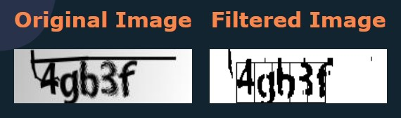
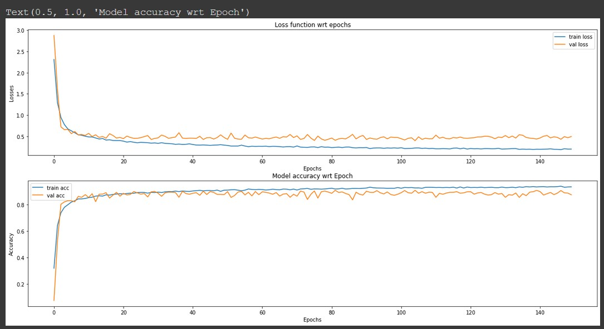

# Brezita

Brezita is a captcha solver and it can effectively predict the characters in the captcha image provided. Brezita is build open upon Tensorflow's CNN model deployed on Flask server.

# Model Building

> ## 1. Dataset

We have used the dataset from kaggle [here](https://www.kaggle.com/fournierp/captcha-version-2-images) which contains 1070 captcha images. The images are 5 letter words that can contain numbers. The images have had noise applied to them (blur and a line).

> ## 2. Data preprocessing

We have used adaptive threshold to extract text from the images, dilated the image and added gaussian blur to image.

  

    img = cv2.adaptiveThreshold(img, 255, cv2.ADAPTIVE_THRESH_GAUSSIAN_C, cv2.THRESH_BINARY, 175, 0)
    img = cv2.morphologyEx(img, cv2.MORPH_CLOSE, np.ones((4,2), np.uint8))
    img = cv2.dilate(img, np.ones((2,2), np.uint8), iterations = 1)
    img = cv2.GaussianBlur(img, (1,1), 0)

> ## 3. Training the model

We have used the keras models to train the model and were able to achieve 0.89 f1 score.

  

Checkout the colab here - https://colab.research.google.com/drive/17NlgFk1JjpBVhiVdvcSNofOJ4kVhhMj8?usp=sharing

# Flask Application

## Steps to setup Flask application.

1. `pipenv install` This will create a virtualenv and install all the required packages.

2. `pipenv shell` This will activate the virtualenv

3. `set FLASK_APP=main.py` This will set main.py in the environment

4. `flask run` This will start the flask server and you can visit the application on http://127.0.0.1:5000/

(OR)

## If you are using Docker just use

1. `docker build -t brezita .` to build the docker image

2. `docker run -p 5000:5000 brezita` to spin the docker container and you can visit the application on http://127.0.0.1:5000/
